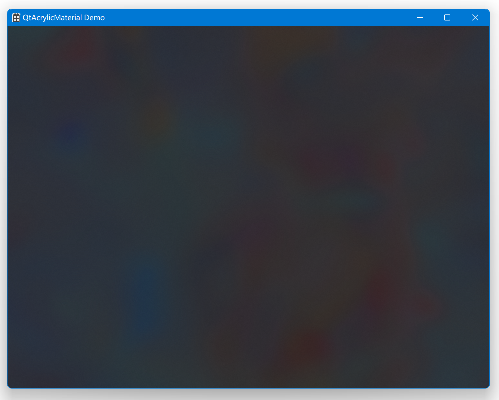

# QtAcrylicMaterial

This is a cross-platform implementation of [Microsoft's Acrylic material](https://docs.microsoft.com/en-us/windows/apps/design/style/acrylic), based on pure Qt Quick technology and supports Qt RHI as well.

## Screenshots

## Supported platforms

- Windows: D3D11, Vulkan, OpenGL
- Linux: Vulkan, OpenGL
- macOS: Metal, Vulkan, OpenGL

Note: Please refer to [Qt's own supported platforms](https://doc.qt.io/qt-6/supported-platforms.html) to get the specific supported OS version.

## Requirements

- Qt version: at least Qt 6, the newer, the better. Tested on Qt 6.3.0.
- Qt modules: QtCore, QtGui, QtShaderTools, QtQuick.
- Compiler: supports C++17 at least, the newer, the better. Tested on MSVC 2022 (Windows), GCC 11 (Linux) and Clang 13 (macOS).
- Build system: the latest version of CMake and ninja. QMake is not tested.

## Limitations

- This library uses the desktop wallpaper as the blur source instead of the visual content behind the window because to achieve the latter much platform-specific black magic will be needed and it also doesn't play well with Qt Quick and Qt RHI.
- The blurred wallpaper has a little latency to catch up with the host window's latest position.
- The host window's resizing performance will be affected much, especially on some old hardware.
- The gaussian blur's appearance is not exactly the same with Microsoft's one, not sure why.
- The CPU & memory usage and power consumption of your application will increase for quite some bit.
- The host window's overall performance will have some impact in some degree.
- This library can update the desktop wallpaper automatically, but only on Windows, because I don't know how to detect the corresponding event on Linux and macOS.

## Acrylic material's definition

